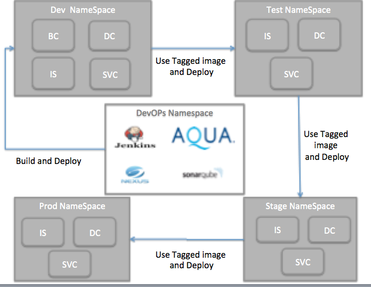

# OpenShift Guided Devops Cookbook

**Background** 
This document/page defines the steps involved in  incorporating devops capability for the offer execution team.
This guide assumes you plan to develop your microservices in Java using Spring Boot framework  or Node.js/Angular.js
however, most of the steps remain same even if you are using a different technology e.g. Python
and you only need to follow the technology specific build, test and run toolset.

Please ensure you have been provided with Guided Development Kit which includes -

* OpenShift cluster URL & hostname
* Credentials for OpenShift and DMB

Process
The following flow-chart depicts the high level process including some of
the tools and IBM practices being demonstrated through the process.

The platform setup, of creatign the various namespeces/project, installing the toolchains can also be handled as a part of this ansible script.For this the change required would be to ensure that the devops role gets executed by making change in apply.yml. Here we will uncomment the devops role and comment out the appsetup role.

    - {role: 'devops',tags:'openshift'}
    - {role: 'appsetup', tags: 'appsetup'}
   
Then execute the command as 

<b>ansible-playbook -i inventory/hosts apply.yml</b>

**Conclusion** 
This guide has given you an overview of how some of IBM's cloud native development
practices and assets together with OpenShift capabilites can provide you with
considerable efficiencies in your cloud journey.

If there is a subject you think we've missed out on and should be covered in this guide,
please write to us at swabarve@in.ibm.com.
